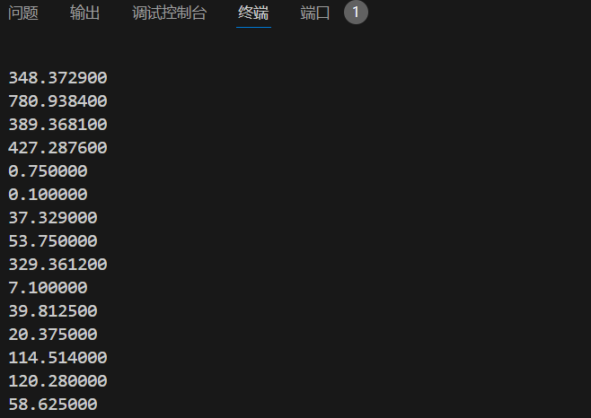
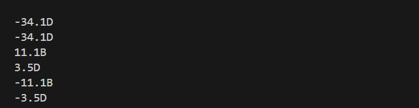
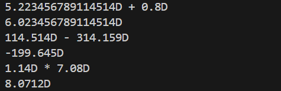

## 课前准备

> 用CS_M_02文件来进行练习

```c
double two_to_ten(char *s){ // 二进制字符串转十进制数
    double ans = 0 ;
    int n = strlen(s);int j;
    for(int i=0;i<n-1;i++){
        if(s[i] =='.') { // 先找小数点
            j = i ;
            break;
        }
    }
    double now = 1; // 分小数点左侧和右侧
    for(int i=j-1;i>=0;i--){
        ans +=now * (s[i]-'0');
        now *=2;
    }
    now =  0.5;
    for(int i=j+1;i<n-1;i++){
        ans += now * (s[i]-'0');
        now /=2;
    }
    return ans;
}
```

十进制同理只需要每次 $*10$ 或 $/10$ 即可，这里就不展示了

文件处理操作
```c
char t[N],s[N];

int main(){
    fptr = fopen("CS_M_02.txt","r");
    while(fgets(t,N,fptr)){
        strcpy(s,t+2);int n = strlen(s);
        s[n-2] = '\0';n = strlen(s);// windwos 换行有两个特殊处理一下
        if(s[n-1] == 'B') printf("%lf",two_to_ten(s));
        else printf("%lf",ten_to_ten(s));
        printf("\n");
    }
```


[完整Code](pretest/pretest.c)



## Task1

> 为什么会出现这样的现象？

浮点数一般为表示为 $-1^{s} * 2 ^E * M$  也就是只能表示为 $2^i$ 的倍数 

对 $0.2$ 来说转为 $2$ 进制为 $0.00110011....$ 无法精确表示

那么计算就会产生误差

> 如何解决？

本质上是因为十进制的小数二进制无法在有限位表示

于是可以 $*10^k$ 把所有小数放到整数上来，这样整数就可以用二进制表示了

我们可以引入十进制小数(如 $java BigDecimal$)

维护小数点的位置，总位置，除去小数点的全部整数

用高精的方法维护即可

```java
public class BigDecimal extends Number implements Comparable<BigDecimal> {
    private BigInteger intVal;
    private int scale;
    private int precision = 0;
    ...
}
```

然而这种方法无法解决 $1/3$ 这样的无限循环小数

我们还可以直接用分数储存, 维护分子与分母进行运算即可，这样最准确但复杂度大大提高了

> 热身

放在下面了


## Task2_step1

整数部分处理是简单的,我们考虑小数,

我们采用 $BCD$ 编码对于32位整数这里采用高精实现

对于不足 $32$ 位的我们补到 $32$ 位

对于二进制小数我们怎么转,这里用 $0.11B$ ( $0.75D$ 举例子)

先把小数点放到最后,相当于 $*2^k$  ，在算出小数部分值 $11B = 3$  ,此时 $3/2^k$ 就是实际值

最后 $*10^{32}$ 就是答案，这里不难发现 $10^{32}$ 有  $32$ 个 $2$ 因子，所以二进制也可以表示 $32$ 位小数

下面是具体实现

首先是高精

这里 $Bigint$ 是在第四题实现的高精,本题设置为32位

``` c
Bigint a , b ;
init(&a);init(&b) //初始化
Add(a,b) //加法 
Del(a,b) //减法
Mul(a,b) //乘法
div(a,b) //除法
Get_Bigint(x->int) //将int类型转化为Bigint类型
Get_10k(k->int) //返回 10^k 的Bigint
print(&a) // 输出
_1e32 = Get_10k(32) // 表示1e32
_1 = Get_10k(0) //表示1
Check_le(a,b) //返回 [a<b]
Check_lef(a,b) //返回 [a<=b]
```

先是储存

相同类型的可以放在一起,减小因内存对齐浪费的空间

```c
typedef struct {
    bool less0;
    Bigint integer;//正数
    Bigint frac;//小数
} PointFixedNum;
```
初始化
- 将十进制转化为定点数
- 将二进制转化为十进制再转化为定点数

根据上文思路，先找小数点从整数与小数分别做
```c
void PointFixedNum_init(PointFixedNum *num,char *s){
    init(&num->integer); 
    init(&num->frac);
    num->less0 = 0 ;
    // 以上为初始化
    int n = strlen(s);
    if(s[0] == '-') {
        num->less0 = 1;
        for(int i=0;i<n;i++) s[i] = s[i+1]; // 删掉符号
    }
    n = strlen(s);
    if(s[n-1] == 'B') { // 二进制
        int pos_point = n-1; // 小数点位置
        for(int i=0;i<n;i++) if(s[i] == '.') pos_point = i;
        for(int i=0,j=pos_point-1;j>=0;j--,i++) // 整数
        if(s[j]=='1')num->integer = Add(num->integer,Get_Bigint(1ll<<i));
        int cnt = 0 ; // 小数有多少位
        for(int j=n-2;j>pos_point;j--,cnt++) // 小数
        num->frac = Add(num->frac ,Get_Bigint(1ll<<cnt));
        num->frac = Mul(div(_1e32 , Get_Bigint(1ll<<cnt)),num->frac);
    }
    if(s[n-1] == 'D') { // 十进制
        int pos_point = n-1; // 小数点位置
        for(int i=0;i<n;i++) if(s[i] == '.') pos_point = i;
        for(int j=0;j<pos_point;j++) // 整数
        num->integer = Add(Mul(num->integer ,Get_10k(1)) , Get_Bigint(s[j] -'0'));
        int cnt = 0 ; // 记录有多少位小数
        for(int j=pos_point+1;j<n-1;j++)
        num->frac = Add(Mul(num->frac ,Get_10k(1)) , Get_Bigint(s[j]-'0')),cnt++;
        while(cnt<32) num->frac = Mul(num->frac ,Get_10k(1)),cnt++; // 不够32位补到32位
    }
}
```

[Code](Task2/numPart1.c)

我们测试一下



## Task2_step2

考虑加减法，根据上一题的高精的启发

先考虑加法怎么做

分类讨论一下

- $a$ , $b$ 均负 $a+b =  -((-a) + (-b))$ 变为正数加法

- 一负一正, $a+b = (-a) + b = b -(-a)$ 变为两个正数减法

- 我们只需要实现正数加法

```c
// 这里PointFixedNum_inv是取反
bool PointFixedNum_Check_le(PointFixedNum a,PointFixedNum b){ // 判断 a<b
    if(a.less0 && b.less0) {
        if(Not_equal(a.integer,b.integer)) return Check_le(b.integer,a.integer);
        return Check_le(b.frac,a.frac);
    }
    if(a.less0) return 1;
    if(b.less0) return 0;
    if(Not_equal(a.integer,b.integer)) return Check_le(a.integer,b.integer);
    return Check_le(a.frac,b.frac);
} 
PointFixedNum PointFixedNum_Add(PointFixedNum a,PointFixedNum b){ // 加法
    if(a.less0 && b.less0) return  PointFixedNum_inv(PointFixedNum_Add(PointFixedNum_inv(a),PointFixedNum_inv(b)));// a<0&&b<0的时候
    if(a.less0) return PointFixedNum_Dec(b,PointFixedNum_inv(a));
    if(b.less0) return PointFixedNum_Dec(a,PointFixedNum_inv(b));//一负一正
    PointFixedNum c = a;
    c.integer = Add(c.integer,b.integer);
    c.frac = Add(c.frac,b.frac);
    if(Check_lef(_1e32,c.frac)) c.frac = Del(c.frac,_1e32),c.integer =Add(c.integer,_1);//处理一下进位
    return c;
}
```


考虑减法 $a-b$

- $a<0$  $a-b = (-(-a + b))$ 变为加法

- $a >0,b< 0$   $a-b = a +(-b)$ 变为正数加法

所以我们只需实现两个正数减法即可 

而且如果 $a<b$ 那么 $a-b = -(b-a)$ 

所以我们只用实现一个大正数减一个小正数即可

```c
PointFixedNum PointFixedNum_Dec(PointFixedNum a,PointFixedNum b){
    if(a.less0) return PointFixedNum_inv(PointFixedNum_Add(PointFixedNum_inv(a),b));
    if(b.less0) return PointFixedNum_Add(a,PointFixedNum_inv(b));
    if(PointFixedNum_Check_le(a,b)) return PointFixedNum_inv(PointFixedNum_Dec(b,a));
    // 对应上文情况
    PointFixedNum c = a;
    c.integer = Del(c.integer,b.integer);
    if(Check_le(c.frac,b.frac)) { // 不够就借位
        c.integer = Del(c.integer,_1);
        c.frac = Add(c.frac,_1e32);
    }
    c.frac=Del(c.frac,b.frac);
    return c;
}
```


考虑乘法

考虑一个小数 $1.23$ ,我们乘了 $10^{32}$

所以 $1.23 = 1 * {10^{32}} + 2 * 10^{31} + 3 * 10^{30}$ 

两数相乘类比多项式乘法,此时小数点在 $10^{64}$ 与 $10^{63}$ 项之间

为了防止过程溢出，我们用一个 $int$ 数组记录多项式乘法结果

最后处理一下进位

```c
PointFixedNum PointFixedNum_Mul(PointFixedNum a,PointFixedNum b){
    PointFixedNum c = a;
    init(&c.frac);
    init(&c.integer);
    c.less0 = a.less0 ^ b.less0;
    for(int i=0;i<=128;i++) tmp_PFN_MUl[i] = 0;
    // 初始化
    if(a.integer.size + b.integer.size -1 > 32)  {printf("溢出");}
    for(int i=0;i<a.integer.size;i++) {
        for(int j=0;j<b.integer.size;j++)
            tmp_PFN_MUl[i+j+64] += (a.integer.num[i] -'0') * (b.integer.num[j] -'0');
        for(int j=0;j<b.frac.size;j++)
            tmp_PFN_MUl[i+j+32] += (a.integer.num[i] -'0') * (b.frac.num[j] -'0');
    }
    for(int i=0;i<a.frac.size;i++) {
        for(int j=0;j<b.integer.size;j++)
            tmp_PFN_MUl[i+j+32] += (a.frac.num[i] -'0') * (b.integer.num[j] -'0');
        for(int j=0;j<b.frac.size;j++)
            tmp_PFN_MUl[i+j] += (a.frac.num[i] -'0') * (b.frac.num[j] -'0');
    }
    // 处理进位情况
    for(int i=0;i<=128;i++){
        tmp_PFN_MUl[i+1] += tmp_PFN_MUl[i] / 10;
        tmp_PFN_MUl[i] %=10;
        if(i<32 && tmp_PFN_MUl[i]) printf("error:小数已超过32位\n");
    }
    // 结算整数位和小数位
    c.frac.size = 32;c.integer.size = 32;
    for(int i=0;i<c.frac.size;i++) c.frac.num[i] = tmp_PFN_MUl[i+32] + '0';
    for(int i=0;i<c.integer.size;i++) c.integer.num[i] = tmp_PFN_MUl[i+64] + '0';
    
    // 处理前导0
    solve0(&c.frac);
    solve0(&c.integer);
    return c;
}
```

测试一下



[Code](Task2/numPart1.c)（因引用第四题的 $Bignum$ 代码,本地运行时请先将同目录下的 $Bignum.c$ 保存至运行目录）

## Task3

将上文代码读入文件后我们得到结果

```
2381.036027D
```

[Code](Task3/numPart2.c)（因引用第四题的 $Bignum$ 代码,本地运行时请先将同目录下的 $Bignum.c$ 保存至运行目录）
